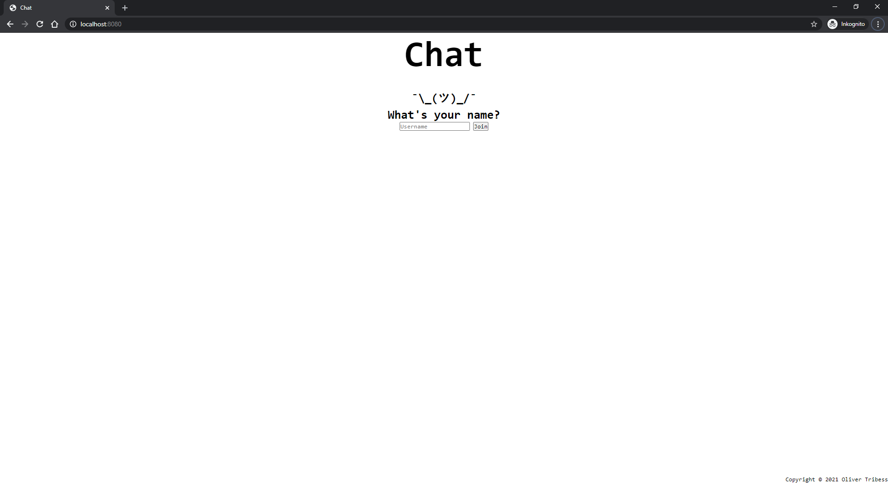

# Chat
[](https://github.com/Tait1337/chat/actions)
[](https://sonarcloud.io/dashboard?id=Tait1337_chat)
[](LICENSE)

Simple Chat Application that makes use of Web Sockets protocol.

Chat with all your friends in a Chatroom. Write public and private messages.

## Getting Started

These instructions will get you a copy of the project up and running on your local machine for development and testing purposes. See deployment for notes on how to deploy the project on a live system.

### Prerequisites

Install Java JDK 17 or higher.

```
https://openjdk.java.net/install/index.html
```

Install Docker.
```
https://docs.docker.com/get-docker/
```

### Installing

Clone the Repository.
```
git clone https://github.com/tait1337/chat.git
```

Run the Web Application.
```
mvn spring-boot:run
```

Navigate to http://localhost:8080.




### Configuration

Within [application.properties](src/main/resources/application.properties) you can modify settings.

## Running the tests

No Tests exist.

## Deployment

The most basic option to run the Application is by building the Dockerimage.

```
docker build -t chat:1.0.0-SNAPSHOT .
docker run -p 8080:8080 -d chat:1.0.0-SNAPSHOT
```

## Contributing

I encourage all the developers out there to contribute to the repository and help me to update or expand it.

To contribute just create an issue together with the pull request that contains your features or fixes.

## Versioning

We use [GitHub](https://github.com/) for versioning. For the versions available, see the [tags on this repository](https://github.com/tait1337/chat/tags).

## Authors

* **Oliver Tribess** - *Initial work* - [tait1337](https://github.com/tait1337)

## License

This project is licensed under the Apache License 2.0 - see the [LICENSE](LICENSE) file for details

## Acknowledgments

* [AdoptOpenJDK](https://adoptopenjdk.net/) Team for providing a free JDK
* [Spring](https://spring.io/) Team for providing the Service creation platform to build stand-alone web apps
* [Mozilla MDN Web Docs](https://developer.mozilla.org/de/docs/Web) Team for hosting the amazing documentation for web technologies  
